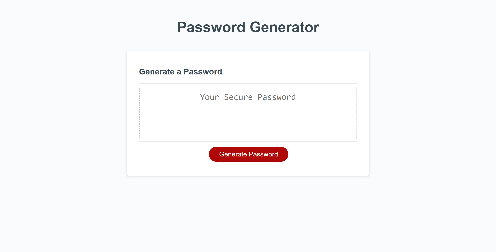

# Password Generator Starter Code

# Purpose

The user can generate a random password by selecting character length and character type.

# Contents

<ul>
    <li><a href="#built-wth"> Built With</a></li>
    <li><a href="#features">Features</a></li>
    <li><a href="#website">Website</a></li>
    <li><a href="#contributions">Contributions</a></li>
</ul>

# Built With

<ul id="built-with">
    <li>HTML</li>
    <li>CSS</li>
    <li>JavaScript</li>
</ul>

# Features

<ul>
    <li id="features">
        User is able to pick a password with 8 - 128 characters
    </li>
    <li>
        User can select from Uppercase, Lowercase, Special, and Numeric characters to generate password.
    </li>
</ul>

# Website

<a href="https://dmorrel7.github.io/PassWord-Generator/">Password Generator</a>

# Contributions

<ul id="contributions">
    <li>
        Our Teacher Assistant at UCF Troy Garcia.
    </li>
    <li>
        The website stackoverflow.
    <li>
    <li>
        The website W3 Schools.
    </li>
</ul>